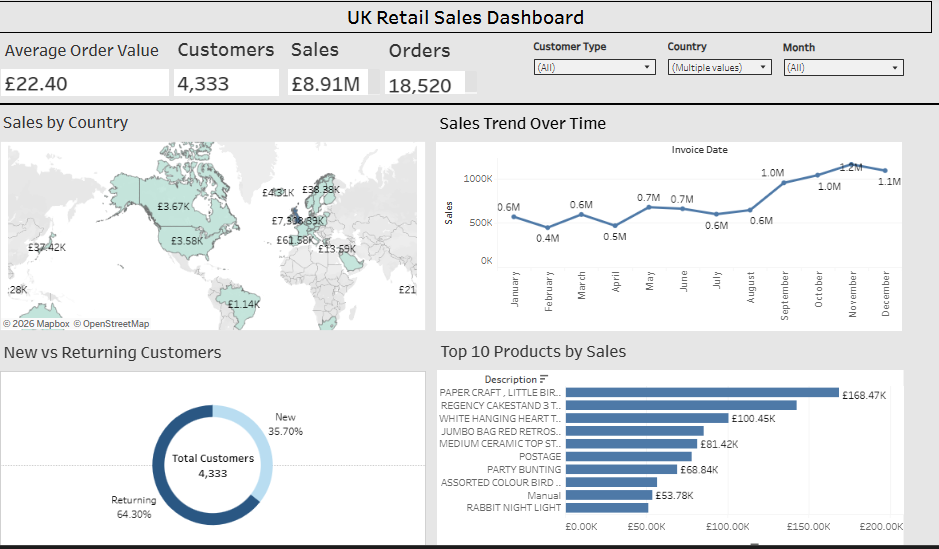

# UK Retail Sales Analysis

End-to-end UK retail sales analysis using MySQL, Excel and Tableau

## Live Dashboard
[View Interactive Dashboard](https://public.tableau.com/authoring/UKRetailSalesCustomerBehaviourdashboard/Dashboard1#1)

## Dashboard Preview

## Project Overview
This project analyses transactional data from a UK-based online retailer
covering December 2010 to December 2011. The goal was to uncover revenue
trends, customer behaviour patterns, and top-performing products through
SQL-based data cleaning and Tableau visualisation.

## Data Source
- **Dataset:** Online Retail Dataset from the UCI Machine Learning Repository
- **Source:** https://archive.ics.uci.edu/ml/datasets/Online+Retail
- **Records:** 397,880 rows | 9 columns
- **Period:** December 2010 – December 2011
- **Geography:** Transactions from a UK-based online retailer serving customers in 37 countries
- **Description:** This dataset contains transactional data including product purchases,
  quantities, pricing, customer IDs, and timestamps, used for analyzing sales performance,
  customer behavior, and market trends.

## Tools
- **MySQL** — Data cleaning and analysis queries
- **Excel** — Initial data exploration
- **Tableau** — Interactive dashboard and visualisation

## Data Cleaning (MySQL)
- Created a raw staging table and loaded the CSV using LOAD DATA LOCAL INFILE
- Converted InvoiceDate from VARCHAR to DATETIME using STR_TO_DATE()
- Handled empty UnitPrice values by converting blank strings to NULL using NULLIF()
- Derived a Sales column by multiplying Quantity by UnitPrice
- Removed records where Quantity or UnitPrice were zero or negative
- Excluded rows with missing CustomerID to ensure customer-level analysis accuracy
- Exported final cleaned table as uk_retail_clean for analysis and visualisation

## Analysis
- **Revenue Trend** — monthly revenue tracked across 12 months to identify
  seasonal patterns and peak trading periods
- **Sales by Country** — revenue distribution across 37 countries to identify
  the strongest and emerging markets
- **New vs Returning Customers** — customer segmentation showing 64% returning
  vs 36% new customers to assess loyalty and retention
- **Top 10 Products** — highest revenue-generating products ranked by total
  sales to identify key inventory priorities
- **RFM Analysis** — customers scored by recency, frequency and monetary value
  to support targeted marketing and segmentation
- **Average Order Value Trend** — monthly AOV tracked to measure changes in
  customer spending behaviour over time

## Results
- Total revenue of £8.91M across 18,520 orders
- United Kingdom generated £7.31M — 82% of total revenue
- 64% returning customer rate vs 36% new customers
- Strong Q4 revenue spike — November peaked at £1.2M
- Top product: Paper Craft Little Birdie at £168.47K
- United Kingdom accounts for 89% of all transactions

## Recommendations
- Focus retention efforts on the 36% new customers to grow the returning base
- Stock up high-revenue products ahead of Q4 to capitalise on seasonal demand
- Explore growth opportunities in Germany and France — the two biggest
  non-UK markets sharing the remaining £1.6M
